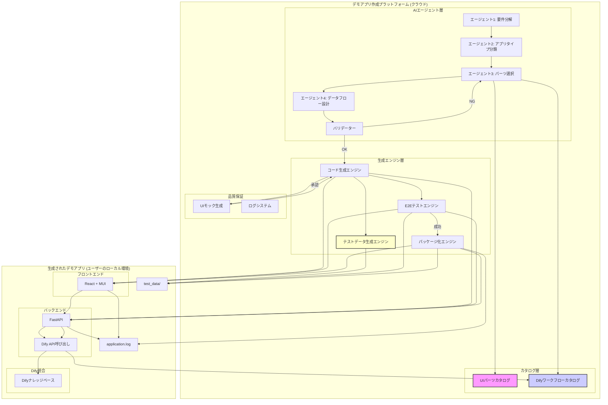
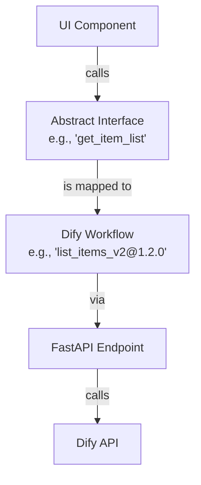
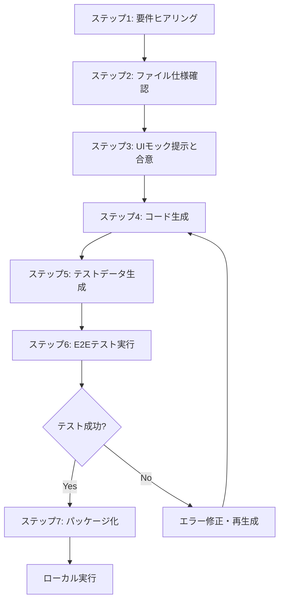
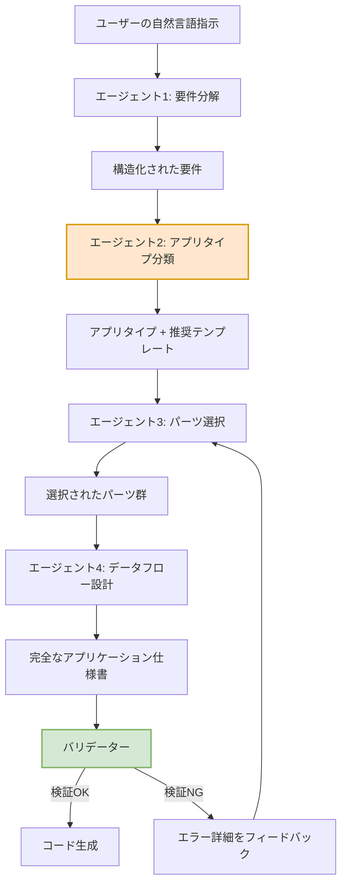

# デモアプリケーション作成プラットフォーム 全体アーキテクチャ

## 1. エグゼクティブサマリー

### 1.1 プラットフォームの目的

**コンセプト:** 「アイデアを、対話で、瞬時にカタチに」

非エンジニアのユーザーが、AIエージェントとの自然言語での対話を通じて、品質保証されたデモアプリケーションを専門知識なしで、かつ迅速に作成できるプラットフォームです。

### 1.2 主要な設計思想

1. **コンポーネントベースアーキテクチャ**: UIパーツとDifyワークフローをカタログ化し、再利用性を確保
2. **階層的マルチエージェント方式**: 単一のLLMではなく、専門化された複数のエージェントが段階的に協調してプランを生成
3. **品質保証の組み込み**: UIモックによる事前合意、E2Eテストによる自動検証、統一ログシステム
4. **ストレージのワークフロー統合**: ストレージ処理を各ワークフローに組み込み、特にDifyナレッジベースへの登録を重視

---

## 2. システム全体アーキテクチャ

### 2.1 高レベルアーキテクチャ

プラットフォームは、**クラウド側のプラットフォーム**と**ユーザーのローカル環境で実行される生成アプリ**の2つの部分で構成されます。



### 2.2 主要コンポーネントの関係性

| コンポーネント | 役割 | 出力 |
|:--------------|:-----|:-----|
| **AIエージェント層** | ユーザーの自然言語指示を構造化されたアプリ仕様に変換 | アプリケーション仕様書 |
| **カタログ層** | 再利用可能なUIパーツとDifyワークフローの定義 | パーツ定義、API定義 |
| **生成エンジン層** | 仕様書から実際のコードを生成し、テストを実行 | 生成されたアプリケーション |
| **品質保証** | UIモック生成、E2Eテスト、ログ収集 | UIモック、テスト結果、ログ |

---

## 3. プラットフォーム側アーキテクチャ

### 3.1 AIエージェント層：階層的マルチエージェント方式

単一のLLMに全てを任せるのではなく、**専門化された複数のエージェント**が段階的に協調してプランを生成します。これにより、パーツが増えても安定してプランを生成できる仕組みを実現します。

#### エージェント1: 要件分解エージェント

**役割:** ユーザーの自然言語指示を、明確な機能要件に分解する

**入力:** ユーザーの指示（自然言語）

**出力:** 構造化された要件リスト

**出力例:**
```json
{
  "requirements": [
    {
      "id": "R1",
      "description": "ユーザーが請求書PDFファイルをアップロードできる",
      "type": "input"
    },
    {
      "id": "R2",
      "description": "アップロードされたPDFから構造化データを抽出する",
      "type": "processing"
    }
  ]
}
```

#### エージェント2: アプリタイプ分類エージェント

**役割:** 要件を分析し、アプリケーションを既定の「タイプ」に分類する。これにより、選択肢を大幅に絞り込む。

**入力:** 構造化された要件リスト

**出力:** アプリタイプ + 推奨テンプレート

**定義済みアプリタイプ:**

| タイプID | タイプ名 | 特徴 |
|:---------|:---------|:-----|
| `TYPE_CRUD` | データ管理アプリ | リスト表示、作成、編集、削除が中心 |
| `TYPE_DOCUMENT_PROCESSOR` | ドキュメント処理アプリ | ファイルのアップロード、解析、結果表示が中心 |
| `TYPE_VALIDATION` | 検証・審査アプリ | データやドキュメントをルールに照らし合わせて検証 |
| `TYPE_ANALYTICS` | 分析・レポートアプリ | データの集計、可視化、レポート生成 |
| `TYPE_CHATBOT` | 対話型アプリ | ユーザーとの対話を通じて情報提供や処理を行う |

**出力例:**
```json
{
  "app_type": "TYPE_VALIDATION",
  "confidence": 0.95,
  "recommended_template": {
    "name": "検証ワークフローテンプレート",
    "structure": {
      "layout": "TwoColumnLayout",
      "left_column": ["FileUpload", "DocumentViewer"],
      "right_column": ["RulesEditor", "ActionButton", "ValidationResult"]
    }
  }
}
```

#### エージェント3: パーツ選択エージェント

**役割:** テンプレートをベースに、具体的な要件に合わせてパーツをカスタマイズする

**入力:** 
- 要件リスト
- アプリタイプ
- 推奨テンプレート
- **絞り込まれたパーツカタログ**（アプリタイプに関連するパーツのみ）

**出力:** 選択されたパーツ群とその配置

**スケーラビリティへの対応:**

カタログの規模が小さいMVP段階では問題ありませんが、パーツ数が数百、数千と増加した場合、LLMが最適なパーツを安定して選択できなくなる可能性があります。

**改善策（将来の拡張）:**
- **Embeddingによるセマンティック検索の導入:** 各UIパーツとワークフローに、その機能や目的を説明するドキュメント（docstring）を付与し、Embedding（ベクトル化）してベクトルデータベースに保存
- **2段階の選択プロセス:**
    1. **検索:** ユーザー要件をEmbeddingし、ベクトル検索で関連性の高いパーツ候補を数十個程度まで絞り込む
    2. **選択:** 絞り込まれた候補の中から、LLMが最終的なパーツを選択する

このハイブリッドアプローチにより、選択肢の数を現実的な範囲に抑え、LLMの負荷を軽減することで、スケーラビリティと選択精度の両方を確保できます。

**出力例:**
```json
{
  "selected_components": [
    {
      "component_id": "C1",
      "component_name": "FileUpload",
      "position": "left_column_top",
      "props": {
        "accepted_formats": ["pdf"],
        "label": "請求書PDFをアップロード"
      },
      "fulfills_requirement": "R1"
    }
  ]
}
```

#### エージェント4: データフロー設計エージェント

**役割:** 選択されたパーツ間のデータの流れを設計する。これが最も重要なステップ。

**入力:** 
- 選択されたパーツ群
- 要件リスト
- 推奨APIフロー

**出力:** データフローの詳細定義

**データフローの設計原則:**
1. **明示的な入出力定義:** 各パーツが何を入力として受け取り、何を出力するかを明確にする
2. **型安全性:** データの型（string, number, object等）を厳密に定義する
3. **依存関係の明示:** あるパーツの出力が、別のパーツの入力になる場合、その依存関係を明記する

**出力例:**
```json
{
  "data_flow": [
    {
      "step": 1,
      "trigger": "user_uploads_file",
      "source_component": "C1 (FileUpload)",
      "action": "call_api",
      "api": "extract_structured_data",
      "api_input": {
        "file": "C1.uploaded_file"
      },
      "api_output_type": "object",
      "store_output_in": "extracted_data"
    }
  ],
  "state_variables": [
    {
      "name": "extracted_data",
      "type": "object",
      "initial_value": null
    }
  ]
}
```

#### バリデーター: 仕様書検証エンジン

**役割:** 生成されたアプリケーション仕様書が実行可能かを検証する

**検証項目:**
1. **パーツの存在確認:** 選択されたパーツが実際にカタログに存在するか
2. **APIの存在確認:** 呼び出されるAPIがDifyカタログに存在するか
3. **データ型の整合性:** あるパーツの出力型と、それを受け取るパーツの入力型が一致するか
4. **依存関係の循環チェック:** データフローに循環依存がないか
5. **必須項目の充足:** 全ての要件が、いずれかのパーツで満たされているか

**検証失敗時の対応:**
- エラーの詳細をエージェント3（パーツ選択）にフィードバックし、再選択を促す
- 最大3回まで再試行し、それでも失敗する場合はユーザーに対話で追加情報を求める

### 3.2 カタログ層

#### UIパーツカタログ

MVP向けに以下のUIパーツを提供。各UIパーツは抽象インターフェースを介してDifyワークフローと連携します（詳細は後述）。

| カテゴリ | UIパーツ名 | 抽象インターフェース | 説明 |
|:---------|:----------|:-------------------|:-----|
| **表示系** | `DataTable` | `get_item_list` | データをテーブル形式で一覧表示 |
| | `CardList` | `get_item_list` | データをカード形式で一覧表示 |
| | `DetailView` | `get_item_details` | 特定の項目の詳細情報を表示 |
| **入力系** | `CreateForm` | `create_item` | 新規データを作成するための入力フォーム |
| | `UpdateForm` | `get_item_details`, `update_item` | 既存のデータを編集するための入力フォーム |
| | `FileUpload` | `upload_and_process` | CSVなどのファイルをアップロードするためのインターフェース |
| **操作系** | `DeleteButton` | `delete_item` | 特定の項目を削除するためのボタン |
| | `ActionButton` | `execute_action` | 「要約実行」「感情分析」など、特定のアクションを実行する汎用ボタン |
| **レイアウト** | `Header` | - | アプリケーションのタイトルやナビゲーションを配置 |
| | `Sidebar` | - | メニューやフィルタオプションを配置 |
| | `TwoColumnLayout` | - | 画面を左右2つのカラムに分割するレイアウト |

**抽象インターフェース層の導入:**

UIパーツとDifyワークフローの密結合を防ぐため、抽象インターフェース層を導入します。



**メリット:**
- UIパーツとワークフローの疎結合により、ワークフローの変更がUIに影響しない
- バージョン管理が容易（どのインターフェースがどのワークフローにマッピングされるかを別設定で管理）
- ワークフローの差し替えや更新が容易

**バージョニングと依存関係管理:**

各UIパーツとワークフローは、セマンティックバージョニング（例: `v1.2.0`）を採用します。

- **依存関係の明示:** 各UIパーツが依存するインターフェースと、そのインターフェースがマッピングされるワークフローのバージョンを明示的に定義
- **生成時情報の記録:** アプリケーション生成時に、使用した各コンポーネントのバージョンをロックファイル（`components.lock`）に記録
- **後方互換性の確保:** マイナーアップデート（`v1.2.0` → `v1.3.0`）は互換性を保ち、メジャーアップデート（`v1.x.x` → `v2.x.x`）は明示的な移行を必要とする

#### Difyワークフローカタログ

MVP向けに以下のAPI/フローを提供。各ワークフローには、必要に応じてナレッジベースへの登録・取得処理が組み込まれます。

| カテゴリ | API/フロー名 | 説明 | ストレージ処理 |
|:---------|:-----------|:-----|:-------------|
| **データ操作 (CRUD)** | `create_item` | 新しいデータ項目を作成する | 必要に応じてナレッジベースに登録 |
| | `list_items` | データ項目の一覧を取得する | ナレッジベースから取得 |
| | `get_item_details` | 特定のデータ項目の詳細を取得する | ナレッジベースから取得 |
| | `update_item` | データ項目を更新する | ナレッジベースを更新 |
| | `delete_item` | データ項目を削除する | ナレッジベースから削除 |
| **ファイル処理** | `upload_and_process` | ファイルをアップロードし、処理する | **処理結果をナレッジベースに登録** |
| | `process_file_to_knowledge` | ファイルを処理してナレッジベースに登録 | **ナレッジベース登録をメイン処理として実施** |
| **LLM活用** | `summarize_text` | 長いテキストを要約する | 必要に応じて結果をナレッジベースに登録 |
| | `analyze_sentiment` | テキストの感情を分析する | 必要に応じて結果をナレッジベースに登録 |
| | `generate_text` | トピックに基づいて文章を生成する | 必要に応じて結果をナレッジベースに登録 |
| | `query_knowledge` | ナレッジベースから情報を検索・取得 | ナレッジベースからの取得のみ |
| **データ変換** | `csv_to_json` | アップロードされたCSVファイルをJSON形式に変換する | 変換結果をナレッジベースに登録（オプション） |
| | `json_to_csv` | JSONデータをCSV形式に変換してダウンロード可能にする | - |

### 3.3 生成エンジン層

#### コード生成エンジン

**入力:** 完全なアプリケーション仕様書（エージェント4の出力 + バリデーション通過）

**処理:**
1. 仕様書からReactコンポーネント（MUI）を生成
2. 仕様書からFastAPIエンドポイントを生成
3. データフロー定義から状態管理とAPI呼び出しロジックを生成
4. Dify APIとの連携コードを生成

**出力:** 
- `frontend/` ディレクトリ（Reactソースコード）
- `backend/` ディレクトリ（FastAPIソースコード）

#### テストデータ生成エンジン

**役割:** E2Eテストに必要なインプットファイルを自動生成またはユーザー提供ファイルを処理

**戦略:** ハイブリッドアプローチ（AIによる自動生成を基本とし、必要に応じてユーザー提供を受け付ける）

**判断基準:**

| ファイル種類 | 複雑度 | 推奨アプローチ | 理由 |
|:------------|:------|:-------------|:-----|
| CSV/Excel | 低（標準的なリスト） | **AIが自動生成** | データ構造が定義可能で、ダミーデータの生成が容易 |
| CSV/Excel | 高（業界特有のフォーマット） | **ユーザーに依頼** | 実際の業務フォーマットに即したテストが必要 |
| 画像 | 低（アイコン、写真等） | **AIが自動生成** | 汎用的な画像で十分。画像生成AIを活用可能 |
| 画像 | 高（医療画像、設計図面等） | **ユーザーに依頼** | 専門性が高く、AIでの再現が困難 |
| PDF | 低（シンプルなテキスト） | **AIが自動生成** | テキストベースのPDFは生成が容易 |
| PDF | 高（複雑なレイアウト） | **ユーザーに依頼** | レイアウトや構造が重要な場合、実物に近いサンプルが必要 |

**実装例（Python）:**
```python
from faker import Faker
import pandas as pd

fake = Faker('ja_JP')

# 顧客リストのダミーデータを生成
customers = []
for _ in range(100):
    customers.append({
        '氏名': fake.name(),
        'メールアドレス': fake.email(),
        '電話番号': fake.phone_number(),
        '住所': fake.address()
    })

df = pd.DataFrame(customers)
df.to_csv('test_data/customer_list.csv', index=False, encoding='utf-8-sig')
```

#### E2Eテストエンジン

**役割:** 生成されたアプリケーションが正しく動作することを自動検証

**技術スタック:** Playwright

**フロー:**
1. AIエージェントが、ヒアリングしたデモシナリオに基づき、Playwrightを用いたテストコードを自動生成
2. アプリケーション生成後、パッケージ化の前に、このテストコードを実行してE2Eテストを自動で実施
3. 全てのテストケースをパスした場合のみ、ユーザーへの納品プロセスに進む
4. テストが失敗した場合は、問題を自動修正し、再度テストを行う

**テストデータの使用:**
- テストデータ生成エンジンで生成されたファイル（`test_data/`）をE2Eテストで使用

#### パッケージ化エンジン

**役割:** 生成されたアプリケーションをDockerコンテナとしてパッケージ化

**パッケージ内容:**
- フロントエンド（React）
- バックエンド（FastAPI）
- ログファイル設定（`application.log`）
- テストデータ（`test_data/`）
- Docker設定ファイル（`docker-compose.yml`）

---

## 4. 生成アプリ側アーキテクチャ

### 4.1 フロントエンド（React + MUI）

**技術スタック:**
- **フレームワーク:** React
- **UIライブラリ:** Material-UI (MUI)
- **理由:** コンポーネントベース開発との親和性と成熟したエコシステム、高品質なコンポーネントと柔軟なデザインカスタマイズ性

**設計方針:**
- UI要素を再利用可能な「UIパーツ」としてカタログ化
- AIエージェントは、本格的なコード生成の前に、画面レイアウトやコンポーネントの配置を示した静的なUIモック（画像またはHTML）を生成し、ユーザーに提示
- ユーザーの合意を得た後に実際のコンポーネントを組み合わせたコード生成に進む
- ユーザーからのデザイン微修正の指示（色、フォント等）には、MUIのテーマ機能やPropsの調整で対応

### 4.2 バックエンド（FastAPI）

**技術スタック:**
- **フレームワーク:** FastAPI
- **理由:** AI分野との親和性と開発の容易性

**設計方針:**
- ビジネスロジックはDify上で「ワークフロー」として構築し、APIとして公開する
- 生成されるバックエンドは、以下の2つの役割を持つ：
  1. **DifyワークフローAPIの呼び出し:** フロントエンドからのリクエストを受け取り、対応するDifyワークフローを呼び出す
  2. **DifyナレッジベースAPIの操作:** Difyワークフローから呼び出されるエンドポイントを提供し、ナレッジベースへの書き込み（作成・更新・削除）を実行
- 各ワークフローはコマンドラインからもテスト実行可能とし、単体での動作保証を行う

**重要な注意点:**
- Difyワークフローからは、FastAPIバックエンドのエンドポイントをHTTP Requestノードで呼び出す
- FastAPIバックエンド内で、DifyのナレッジベースAPI（REST API）を使用してナレッジベースへの書き込みを実行
- 認証情報（APIキー等）は環境変数やシークレット管理で安全に管理

### 4.3 データ保存とストレージ：ワークフロー統合アプローチ

ストレージは独立したAPIパーツとして扱うのではなく、**各アクションのワークフローに組み込まれる**という設計方針を採用します。

#### 4.3.1 基本方針

ストレージ処理は以下のように各ワークフローに組み込まれます：

- **アップロードフロー:** ファイルアップロード → 処理 → **ナレッジベース登録（必要な場合）**
- **結果生成フロー:** 処理実行 → 結果生成 → **ナレッジベース登録（必要な場合）**
- **CRUDフロー:** データ操作 → **一時保存（必要に応じて）**

#### 4.3.2 Difyナレッジベースへの登録フロー

**優先アプローチ:** Difyのワークフロー内で直接ナレッジベースに登録できる機能を活用します。

**フロー例1: ファイルアップロード → ナレッジベース登録**


**実装フロー:**
- ファイルアップロードを受け取る（Difyワークフロー）
- 必要に応じてファイルを処理・解析する（Difyワークフロー）
- HTTP Requestノードで**FastAPIバックエンドのエンドポイント**を呼び出す
- FastAPIエンドポイント内で**DifyナレッジベースAPI**を使用して登録処理を実行
- 登録された情報は、後続のLLM処理（RAG等）で利用可能

**フロー例2: 処理結果 → ナレッジベース登録**


**適用シーン:**
- ドキュメント解析結果の保存
- 分析結果の蓄積
- ユーザー入力データの記録
- 会話履歴の保存

#### 4.3.3 ワークフローカタログでの表現

各ワークフローは、ストレージ処理を組み込んだ形で定義されます：

| ワークフロー名 | 説明 | ストレージ処理の組み込み |
|:--------------|:-----|:------------------------|
| `upload_and_process` | ファイルをアップロードし、処理してナレッジベースに登録 | アップロード → 処理 → **ナレッジベース登録** |
| `process_and_store` | データを処理し、結果をナレッジベースに保存 | 処理 → **ナレッジベース登録** |
| `query_knowledge` | ナレッジベースから情報を検索・取得 | ナレッジベースからの取得のみ |
| `create_item` | データ項目を作成し、必要に応じてナレッジベースに登録 | 作成 → **ナレッジベース登録（オプション）** |

#### 4.3.4 Difyナレッジベース登録の実装方針

**実装方針: FastAPIバックエンド経由でのDify API呼び出し**

**重要:** Difyの標準機能では、ワークフローからナレッジベースへの書き込み（作成・更新・削除）はサポートされていません。Knowledge Retrievalノードは既存のナレッジベースからの**読み取り専用**です。

このため、以下のアーキテクチャを採用します：

**実装方式:**
1. **生成されるFastAPIバックエンド**に、DifyナレッジベースAPIを呼び出すエンドポイントを実装
2. **Difyワークフロー**からは、HTTP Requestノードを使ってこのFastAPIエンドポイントを呼び出す
3. FastAPIエンドポイント内で、DifyのナレッジベースAPI（REST API）を使用してナレッジベースへの書き込みを実行

**メリット:**
- 認証情報を安全に管理（環境変数やシークレット管理）
- 複雑なロジックや前処理を実装可能
- エラーハンドリングの柔軟性
- ワークフロー内に認証情報を埋め込む必要がない（セキュリティ向上）

**実装フロー例:**


**注意:** Difyワークフローから直接DifyナレッジベースAPIを呼び出す方法も技術的には可能ですが、ワークフロー内にAPIキーなどの認証情報を直接埋め込む必要があるため、セキュリティリスクが高く非推奨です。

#### 4.3.5 一時的なデータ保存（オプション）

セッション間でのデータ保持が必要な場合のみ、以下の方法を検討します：

- **Dify Storage Plugin（hjlarry/storage）:** 一時的なKey-Valueストレージ
- **用途:** APIトークン、セッション情報、一時キャッシュなど

ただし、これらも可能な限りワークフローに組み込み、独立したAPIとして提供しない方針とします。

### 4.4 ロギングシステム

**目的:** エラー発生時に、ユーザーが原因究明のための情報を簡単に取得・提供できるようにする

**方針:**
- フロントエンド（React）とバックエンド（FastAPI）で発生するすべてのイベントやエラーのログは、コンテナ内の単一ファイル（`/var/log/application.log`）に集約して出力する
- ログはJSON形式で統一し、発生時刻、ログレベル（INFO, ERROR）、メッセージ、発生源（フロントエンド/バックエンド）などの情報を含める
- エラーが発生した場合、ユーザーにこのログファイルの存在を案内し、提出を依頼することで、迅速なデバッグ支援を可能にする

**技術スタック:**
- **Python:** Loguru
- **JavaScript:** pino
- **理由:** 導入が容易で、構造化されたログをJSON形式で統一的に出力可能

---

## 5. データフローとプロセス

### 5.1 アプリ生成プロセス（7ステップ）



**詳細:**

1. **ヒアリング:** AIエージェントがユーザーと対話し、機能、画面、デモシナリオを定義する
2. **ファイル仕様の確認:** アップロード機能がある場合、ファイルの種類と構造を確認し、テストデータの準備方法を提案する
3. **UIモック提示と合意:** AIエージェントがUIモックを生成し、ユーザーの承認を得る
4. **パーツ選定:** 合意したUIに基づき、最適なUIパーツとDifyワークフローを選択する（エージェント1-4の処理）
5. **コード生成:** ReactとFastAPIのソースコードを生成する
6. **テストデータ生成:** E2Eテストに必要なインプットファイルを自動生成（またはユーザー提供ファイルを組み込み）する
7. **自動E2Eテスト:** AIエージェントがデモシナリオに基づきE2Eテストを実行し、品質を保証する
8. **パッケージ化:** テストをパスしたソースコード、設定ファイル、統一ログ機能、テストデータをDockerコンテナとしてパッケージ化する

### 5.2 エージェント間の協調フロー



### 5.3 ワークフローとUIパーツの連携例

**シナリオ1:** 「請求書PDFをアップロードして検証するアプリを作成したい」

**エージェントが生成する構成:**

| UIパーツ | 接続される抽象インターフェース | データフロー |
|:--------|:---------------------------|:------------|
| `FileUpload` | `upload_and_process` | ユーザーがPDFをアップロード → Difyワークフローが処理 → **FastAPI経由でナレッジベースに登録** → 結果を返却 |
| `ValidationResult` | `validate_against_rules` | ナレッジベースからデータ取得（Knowledge Retrievalノード） → 検証実行 → 結果表示 |

**シナリオ2:** 「顧客情報を管理するアプリを作成したい」

**エージェントが生成する構成:**

| UIパーツ | 接続される抽象インターフェース | データフロー |
|:--------|:---------------------------|:------------|
| `CreateForm` | `create_item` | ユーザーがフォームに入力 → Difyワークフローが処理 → **FastAPI経由で必要に応じてナレッジベースに登録** → 結果を返却 |
| `DataTable` | `get_item_list` | ページ読み込み時 → Difyワークフローが**Knowledge Retrievalノードでナレッジベースから取得** → DataTableに表示 |
| `UpdateForm` | `update_item` | 編集ボタンクリック → 現在のデータを取得 → UpdateFormに表示 → 保存ボタンクリック → Difyワークフローが処理 → **FastAPI経由でナレッジベースに反映** |
| `DeleteButton` | `delete_item` | 削除ボタンクリック → Difyワークフローが処理 → **FastAPI経由でナレッジベースから削除** |

**重要なポイント:**
- ストレージ処理は各ワークフローの一部として組み込まれている
- UIパーツは、抽象インターフェースを介してワークフローと連携する
- ナレッジベースへの**読み取り**は、Difyワークフロー内のKnowledge Retrievalノードで直接実行可能
- ナレッジベースへの**書き込み**は、FastAPIバックエンド経由でDify APIを呼び出す必要がある

---

## 6. 技術スタック詳細

### 6.1 技術選定一覧

| 領域 | 選定技術 | 理由 |
|:-----|:---------|:-----|
| **バックエンドロジック** | Dify | 迅速なプロトタイピングと非エンジニアによる改修性を実現 |
| **フロントエンドフレームワーク** | React | コンポーネントベース開発との親和性と成熟したエコシステム |
| **UIライブラリ** | MUI (Material-UI) | 高品質なコンポーネントと柔軟なデザインカスタマイズ性 |
| **生成バックエンド** | Python (FastAPI) | AI分野との親和性と開発の容易性 |
| **E2Eテストフレームワーク** | Playwright | 対話シナリオからテストコードを自動生成しやすく、ブラウザ操作を忠実に再現できる |
| **ロギングライブラリ** | Loguru (Python), pino (JS) | 導入が容易で、構造化されたログをJSON形式で統一的に出力可能 |
| **テストデータ生成** | Faker (Python) | 多言語対応のリアルなダミーデータを簡単に生成できる |
| **生成物の配布形式** | Dockerコンテナ | 環境差異を吸収し、ワンコマンドでの起動を実現 |

### 6.2 主要ライブラリ・フレームワーク

#### フロントエンド
- **React:** UI構築の基盤
- **Material-UI (MUI):** コンポーネントライブラリ
- **React Router:** ルーティング（将来の拡張用）
- **React Query (TanStack Query):** サーバー状態管理（将来の拡張用）

#### バックエンド
- **FastAPI:** RESTful APIサーバー
- **Dify:** ワークフロー管理とLLM統合
- **Difyナレッジベース:** データ保存とRAG（Retrieval-Augmented Generation）のための主要ストレージ
- **Dify Storage Plugin（オプション）:** 一時的なKey-Valueストレージ（必要に応じて）

#### テスト・品質保証
- **Playwright:** E2Eテスト
- **Faker:** テストデータ生成
- **Loguru / pino:** ロギング

#### インフラ
- **Docker / docker-compose:** コンテナ化とデプロイメント

---

## 7. 品質保証戦略

### 7.1 UIモックによる事前合意

**目的:** 開発着手後の手戻りを防ぎ、ユーザーのイメージとの齟齬をなくす

**フロー:** 対話エンジンが要件を整理した後、まずUIのワイヤーフレームやモックアップを生成してユーザーに提示する。ユーザーが承認したデザインに基づいて、初めて実際のコード生成を開始する。

### 7.2 エージェントによるE2Eテスト

**目的:** 納品前に、ユーザーが実際に操作するシナリオ通りにアプリが動作することを保証する

**フロー:**
1. AIエージェントは、ヒアリングしたデモシナリオに基づき、Playwrightを用いたテストコードを自動生成する
2. アプリケーション生成後、パッケージ化の前に、このテストコードを実行してE2Eテストを自動で実施する
3. 全てのテストケースをパスした場合のみ、ユーザーへの納品プロセスに進む
4. テストが失敗した場合は、問題を自動修正し、再度テストを行う

### 7.3 E2Eテストにおけるインプットファイル戦略

**基本方針:** ハイブリッドアプローチ（AIによる自動生成を基本とし、必要に応じてユーザー提供を受け付ける）

詳細は「3.3.2 テストデータ生成エンジン」を参照。

### 7.4 統一されたロギング

**目的:** エラー発生時に、ユーザーが原因究明のための情報を簡単に取得・提供できるようにする

詳細は「4.4 ロギングシステム」を参照。

---

## 8. 期待される効果

このアーキテクチャにより、以下を実現します。

### 8.1 ユーザー体験の向上

- **迅速なプロトタイピング:** 対話だけでデモアプリを作成
- **品質保証:** E2Eテストにより、納品前に動作を確認
- **安心のエラー対応:** 統一ログにより、問題発生時も迅速にサポート
- **柔軟なテストデータ管理:** AIによる自動生成とユーザー提供のハイブリッド戦略

### 8.2 技術的なメリット

- **選択精度の向上:** テンプレートによる絞り込みで、LLMが適切なパーツを選びやすくなる
- **データ連携の安定性:** データフロー専用エージェントと検証エンジンにより、連携ミスを防止
- **生成結果の一貫性:** テンプレートベースで構造が統一され、同じ指示で同じ結果が得られやすい
- **デバッグの容易性:** 各段階の出力が構造化されているため、どこで問題が起きたか特定しやすい
- **拡張性:** 新しいパーツやテンプレートを追加しても、既存の仕組みに影響を与えにくい

---

## 9. 実装ロードマップ

### Phase 1: MVP実装（最優先）

1. **AIエージェント層（基本）**
   - エージェント1-4の基本実装
   - バリデーターの基本実装

2. **カタログ層**
   - UIパーツカタログ（MVP向け）
   - Difyワークフローカタログ（MVP向け）

3. **生成エンジン層（基本）**
   - React + FastAPIコード生成
   - テストデータ生成（Faker使用）
   - E2Eテスト生成・実行（Playwright）

4. **ストレージ統合（MVP）**
   - 各ワークフローにストレージ処理を組み込み
   - **FastAPIバックエンド経由でDifyナレッジベースAPIを呼び出す仕組みを実装**
   - `upload_and_process`、`process_file_to_knowledge`などのワークフローを実装
   - DifyワークフローからFastAPIエンドポイントを呼び出すHTTP Requestノードの設定

5. **品質保証（基本）**
   - UIモック生成
   - 統一ログシステム

### Phase 2: UX向上とスケーラビリティ確保

1. **プラットフォームUI**
   - ランディング画面
   - アプリ生成フロー画面（7ステップ）
   - 生成アプリ一覧画面

2. **エージェントの精度向上**
   - Few-shot Learningの追加
   - Chain of Thoughtの強化
   - **Embeddingによるセマンティック検索の導入**（パーツ選択のスケーラビリティ向上）

3. **テスト・デバッグ機能の強化**
   - エラーハンドリングの改善
   - ログビューアーの実装

4. **コンポーネント管理の強化**
   - セマンティックバージョニングの完全実装
   - 依存関係の自動検証
   - バージョンアップデートの自動検出と通知

### Phase 3: 高度な機能

1. **ストレージ・ナレッジベース拡張**
   - ナレッジベースの高度な検索機能
   - ナレッジベースの管理機能（バージョン管理など）
   - 一時ストレージの最適化（必要に応じて）

2. **管理機能**
   - テンプレート管理
   - UIパーツ管理
   - Dify API管理

3. **コラボレーション機能**
   - アプリの共有
   - バージョン管理

---

## 10. まとめ

本アーキテクチャは、以下のキーポイントにより、非エンジニアのユーザーが安心して使えるプラットフォームを実現します。

1. **階層的マルチエージェント方式:** 専門化されたエージェントが段階的に協調してプランを生成
2. **アプリタイプ分類による選択肢の絞り込み:** テンプレートベースで選択肢を削減
3. **データフロー専用エージェントによる連携設計:** パーツ間のデータ受け渡しを正確に設計
4. **バリデーターによる事前検証とフィードバックループ:** 実行不可能なプランを事前に検出
5. **ストレージのワークフロー統合:** ストレージ処理を各ワークフローに組み込み、FastAPIバックエンド経由でDifyナレッジベースAPIを呼び出すことで、ナレッジベースへの登録を実現
6. **抽象インターフェース層による疎結合設計:** UIパーツとDifyワークフローの間の抽象インターフェースにより、変更への耐性とメンテナンス性を向上
7. **品質保証の組み込み:** UIモック、E2Eテスト、統一ログにより品質を保証

**重要な技術的制約と対応:**
- Difyの標準機能では、ワークフローからナレッジベースへの書き込みはサポートされていない
- このため、FastAPIバックエンド経由でDifyナレッジベースAPIを呼び出すアーキテクチャを採用
- Difyワークフロー内のKnowledge Retrievalノードは読み取り専用であり、後続のLLM処理（RAG）で活用可能

この設計により、「アイデアを形にする壁」を劇的に下げ、誰もが自分のビジョンを素早く具現化できる世界を実現します。

---

## 付録A: 参照ドキュメント

- [デモアプリケーション作成プラットフォーム 設計方針書 (Final)](idea/デモアプリケーション作成プラットフォーム%20設計方針書%20(Final).md)
- [安定したプラン生成のためのアーキテクチャ設計](idea/安定したプラン生成のためのアーキテクチャ設計.md)
- [ストレージのパーツ化戦略](idea/ストレージのパーツ化戦略.md)
- [E2Eテストにおけるインプットファイル戦略](idea/E2Eテストにおけるインプットファイル戦略.md)
- [MVP向けDify API/フローカタログ](idea/1.%20MVP向けDify%20API_フローカタログ.md)
- [ユーザー動線とUI設計](ui-design/user-journey-and-ui-components.md)

