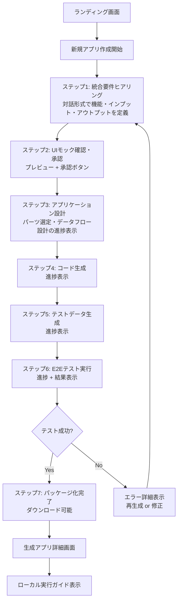

# プラットフォーム完成形: ユーザー動線とUI設計

## 1. ユーザー動線（完成形）

### 1.1 メインユーザー動線：アプリ生成フロー

**変更点:**
- **ステップ1と2を統合**: 「要件ヒアリング」と「ファイル仕様確認」を統合し、「統合要件ヒアリング」として再設計
- **新ステップ3を追加**: バックエンド処理（パーツ選定・データフロー設計）を可視化するステップを追加
- **ステップ番号の調整**: ステップ3以降の番号が繰り上がり

### 1.2 サブユーザー動線

1. **生成アプリ一覧からの操作**
   - 生成済みアプリの一覧表示
   - アプリの詳細確認・実行
   - ログファイルの確認・ダウンロード
   - アプリの再生成・削除

2. **設定・管理**（将来的に）
   - テンプレート管理
   - UIパーツ管理
   - Dify API管理
   - ユーザー設定

## 2. UI画面構成とコンポーネント設計

### 2.1 ランディング画面（Home）

**目的**: プラットフォームの説明と新規作成開始

**必要なコンポーネント**:
- `HeroSection`: プラットフォームの説明とCTA
- `FeatureCards`: 主要機能の紹介
- `TutorialSection`: 使い方ガイドとデモ動画（Phase 1 MVPで追加）
- `AppListPreview`: 最近生成したアプリ（3件程度）のプレビュー
- `CreateAppButton`: 新規アプリ作成開始ボタン

**将来的な拡張**:
- 利用統計（生成アプリ数など）

### 2.2 アプリ生成フロー画面（メイン）

#### ステップ1: 統合要件ヒアリング画面

**目的**: AIエージェントとの対話を通じて、機能・画面・インプット・アウトプットを統合的に定義する

**設計思想**: ユーザーの自然な思考プロセスに沿い、機能定義と同時にインプット/アウトプットを確認できる対話フローを実現

**必要なコンポーネント**:
- `ChatInterface`: チャット形式の対話UI（拡張）
  - メッセージ表示エリア（スクロール可能）
  - メッセージ入力欄（マルチライン対応）
  - 送信ボタン
  - タイピングインジケーター（AI応答中）
  - **ファイルアップロード機能（ドラッグ&ドロップ対応）** - 新規
  - **構造化メッセージの表示**（カード形式、リスト形式）- 拡張
  - **インタラクティブな選択肢**（ボタン形式で選択可能）- 拡張
- `InlineFileUpload`: チャット内でファイルをアップロード（新規・Phase 1 MVP）
- `InlineFilePreview`: アップロードされたファイルのプレビュー（新規・Phase 1 MVP）
- `SamplePrompts`: サンプルプロンプトの表示（新規・Phase 1 MVP）
  - 「請求書検証アプリ」「顧客管理アプリ」などの例を提示
  - クリック一つで対話を開始可能
- `ContextualHelp`: 文脈に応じたヘルプメッセージ（新規・Phase 1 MVP）
  - 対話中も文脈に応じたヒントや質問例を表示
  - ユーザーの迷いを最小化
- `StepIndicator`: 現在のステップ表示
- `RequirementsSummary`: 確定した要件の構造化表示（インプット/アウトプット含む・拡張）
  - アプリ概要（目的、主要機能）
  - インプット（種類、詳細）
  - アウトプット（種類、詳細）
  - 画面リスト
  - デモシナリオ
  - 折りたたみ可能
- `NavigationButtons`: 次へ/戻る/保存
  - **下書き保存機能**: 「最終保存: 1分前」のように表示し、安心感を与える
  - 明示的な「下書きとして保存」ボタンも提供

**対話のフェーズ（内部的構造）:**
1. **フェーズ1: 目的と概要の確認** - アプリの目的、主要機能、想定ユーザー
2. **フェーズ2: インプットの定義** - ファイル、フォーム入力、API、またはなし
3. **フェーズ3: アウトプットの定義** - 画面表示、ファイルダウンロード、API応答など
4. **フェーズ4: 画面構成とデモシナリオの確認** - 必要な画面の一覧と各画面の役割

**条件分岐:**
- インプットの種類に応じて、AIが適切な質問を投げかける
- ファイルを伴わないアプリでは、ファイルに関する質問は一切発生しない

**将来的な拡張**:
- 音声入力対応
- ファイル構造の自動解析（Phase 2: UX向上）

#### ステップ2: UIモック確認・承認画面

**目的**: 生成されたUIモックを確認し、承認または修正指示

**必要なコンポーネント**:
- `MockPreview`: UIモックのプレビュー表示
  - 画像表示エリア
  - ズーム/パン機能
  - レスポンシブプレビュー（モバイル/デスクトップ切り替え）
- `ApprovalButtons`: 承認/修正依頼ボタン
- `FeedbackForm`: 修正指示入力フォーム（承認しない場合・拡張）
  - **構造化されたフィードバックフォーム**（Phase 1 MVP）
    - 修正箇所の選択（例：ヘッダー、ボタン、レイアウト）
    - 修正内容の選択（例：色、テキスト、サイズ、位置）
    - テキスト入力（追加コメント）
  - 画像上の注釈機能（Phase 3: 高度な機能）
- `StepIndicator`
- `NavigationButtons`

**将来的な拡張**:
- インタラクティブなモック（HTMLベース・Phase 3）
- デザインカスタマイズ（色、フォントなど・Phase 2）

#### ステップ3: アプリケーション設計画面（新規追加）

**目的**: バックエンドで実行される「パーツ選定」と「データフロー設計」を可視化し、ユーザーの信頼感を向上させる

**必要なコンポーネント**:
- `DesignProgressIndicator`: 設計の進捗を表示
  - 「UIパーツを選定しています...」
  - 「データフローを設計しています...」
  - 「仕様書を検証しています...」
- `DesignStepList`: 実行中の設計ステップを表示
  - エージェント1: 要件分解
  - エージェント2: アプリタイプ分類
  - エージェント3: パーツ選択
  - エージェント4: データフロー設計
  - バリデーター: 仕様書検証
- `DesignSummary`: 選定されたパーツとデータフローの概要を表示（オプション）
  - 選択されたUIパーツ一覧
  - 使用されるDifyワークフロー
  - データフローの概要図
- `StepIndicator`
- `NavigationButtons`: このステップでは「次へ」ボタンは非表示（自動進行）

**注意**: このステップは、バックエンド処理を可視化するために追加されました。処理が完了すると自動的に次のステップに進みます。

#### ステップ4-6: 生成・テスト実行画面

**目的**: コード生成、テストデータ生成、E2Eテスト実行の進捗表示

**必要なコンポーネント**:
- `ProgressStepper`: 各工程の進捗表示
  - コード生成中
  - テストデータ生成中
  - E2Eテスト実行中
- `ProgressBar`: 詳細な進捗バー
- `LogViewer`: リアルタイムログ表示（拡張）
  - **「シンプル表示」モード**（Phase 1 MVP）: 「UIコンポーネントを組み立てています...」のような平易な言葉で状況を伝える
  - **「詳細表示」モード**: 技術者向けに完全なログを確認可能
  - 表示モードの切り替えボタン
- `TestResultsPanel`: テスト結果の表示
  - 成功/失敗サマリー
  - 失敗したテストケースの詳細
  - スクリーンショット（エラー時）
- `ActionButtons`: 再生成/ダウンロード/詳細確認ボタン

**リアルタイム更新と永続性**:
- WebSocketまたはServer-Sent Events (SSE) を用いてサーバーからの進捗をリアルタイムに反映
- 処理が完了した際にはメールやWeb Push通知でユーザーに知らせる
- ユーザーがブラウザを閉じたりネットワークが切断された場合でも、再訪時に進行中のタスクの状態を自動的に復元

**将来的な拡張**:
- 生成途中でのキャンセル機能
- 部分的リトライ機能

#### ステップ7: 完了画面

**目的**: パッケージ化完了とダウンロード、次のアクション案内

**必要なコンポーネント**:
- `SuccessMessage`: 完了メッセージ
- `DownloadCard`: ダウンロード情報
  - ファイル名
  - ファイルサイズ
  - 生成日時
  - ダウンロードボタン
- `QuickStartGuide`: ローカル実行ガイド（折りたたみ可能）
  - Docker起動コマンド
  - アクセスURL
  - トラブルシューティングリンク
- `ActionButtons`: 一覧に戻る/別のアプリを作成

### 2.3 生成アプリ一覧画面

**目的**: 生成済みアプリの一覧表示と管理

**必要なコンポーネント**:
- `AppList`: アプリ一覧表示
  - `AppCard`: 各アプリのカード表示
    - アプリ名・説明
    - 生成日時
    - アプリタイプ
    - ステータス（成功/失敗）
    - サムネイル画像（UIモックから）
    - クイックアクション（詳細/ダウンロード/削除）
- `FilterBar`: フィルタリング機能
  - アプリタイプでフィルタ
  - 日付範囲でフィルタ
  - 検索機能
- `SortOptions`: ソート機能（日付順、名前順など）
- `Pagination`: ページネーション（アプリ数が多い場合）

**将来的な拡張**:
- タグ機能
- フォルダ/カテゴリ分類
- 共有機能

### 2.4 生成アプリ詳細画面

**目的**: 生成されたアプリの詳細情報表示と操作

**必要なコンポーネント**:
- `AppHeader`: アプリ基本情報
  - アプリ名
  - 説明
  - 生成日時・更新日時
  - アプリタイプ・テンプレート
- `AppPreview`: アプリのプレビュー
  - 生成されたUIのスクリーンショット
  - インタラクティブプレビュー（将来的に）
- `DownloadSection`: ダウンロードセクション
  - 最新版ダウンロード
  - 過去バージョン（将来的に）
- `TestResultsSection`: テスト結果詳細
  - E2Eテスト結果
  - カバレッジ情報（将来的に）
- `LogsSection`: ログファイルの確認・ダウンロード
  - ログビューアー（基本的なテキスト表示）
  - ダウンロードボタン
- `ActionButtons`: 操作ボタン
  - 再生成
  - 削除
  - エクスポート（設定のエクスポート、将来的に）

**将来的な拡張**:
- アプリの編集/カスタマイズ
- バージョン管理
- コラボレーション機能

### 2.5 共通レイアウトコンポーネント

**必要なコンポーネント**:
- `AppLayout`: アプリ全体のレイアウト
  - `Header`: トップヘッダー
    - ロゴ/ブランド名
    - ナビゲーションメニュー
    - ユーザー情報（将来的に）
  - `Sidebar`: サイドバー（オプション）
    - ナビゲーションメニュー
    - クイックアクション
  - `MainContent`: メインコンテンツエリア
  - `Footer`: フッター（オプション）
- `Breadcrumbs`: パンくずリスト
- `ErrorBoundary`: エラーハンドリング
- `ErrorDetailPanel`: エラーの詳細と対処法を表示（新規・Phase 1 MVP）
  - **平易な言葉で書かれたエラー原因**（技術的なログではなく、ユーザーフレンドリーな説明）
  - **推奨される対処法**（例：「要件をより具体的にしてください」「別のファイルを試してください」）
  - **具体的なアクションボタン**（「自動で修正を試す」「要件定義に戻る」など）
- `SkeletonLoader`: コンテンツ読み込み中のスケルトン表示（新規・Phase 1 MVP）
- `LoadingOverlay`: 全画面ローディング表示
- `ToastNotification`: トースト通知（成功/エラー/警告・拡張）
  - アクション付きの通知（例：「再試行」ボタン）
- `ModalDialog`: モーダルダイアログ（確認ダイアログなど）
- `ConfirmDialog`: 確認ダイアログ（削除確認など）

## 3. UIコンポーネントの実装優先度

### Phase 1 (MVP): 基本機能の実現

**最優先（ユーザー体験の核心）:**
- **統合要件ヒアリング画面**（ステップ1と2を統合）
  - チャットインターフェース（ファイルアップロード対応）
  - サンプルプロンプト（`SamplePrompts`）
  - コンテキストヘルプ（`ContextualHelp`）
  - インラインファイルアップロード・プレビュー
- **アプリケーション設計画面**（ステップ3・新規追加）
  - 設計進捗の可視化
- **エラー詳細パネル**（`ErrorDetailPanel`）
  - 平易な言葉でのエラー説明
  - 具体的な対処法の提示
- **ランディング画面**（基本版）
  - チュートリアルセクション（`TutorialSection`）
- **アプリ生成フロー画面**（ステップ1-7）
  - UIモック確認・承認（構造化フィードバックフォーム）
  - 生成・テスト実行（シンプル/詳細表示切り替え可能なログビューアー）
  - 下書き保存機能の明確な表示
- **生成アプリ一覧画面**（基本版）
- **共通レイアウトコンポーネント**（基本版）
  - スケルトンローダー
  - エラーハンドリング強化

### Phase 2: UX向上

- **ファイル構造の自動解析**（統合要件ヒアリング内）
- チャットインターフェースの改善（構造化メッセージ、インタラクティブ選択肢）
- 進捗表示の改善（WebSocket/SSEによるリアルタイム更新、永続性対応）
- レスポンシブデザインの最適化
- デザインカスタマイズ機能（UIモック画面）
- **サイドバー**の追加（機能拡張に伴い）

### Phase 3: 高度な機能

- **インタラクティブなモック**（HTMLベース・UIモック画面）
- 生成アプリ詳細画面の拡張
- 管理機能（テンプレート/パーツ管理）
- コラボレーション機能
- 分析・統計機能

## 4. ユーザビリティの改善ポイント

### 4.1 初回ユーザーへのガイダンス

**課題**: 初回ユーザーが最初のアプリを成功裏に生成できるよう、あらゆるステップで支援を提供する必要があります。

**実装内容**:
- **ランディング画面**: チュートリアルセクション（`TutorialSection`）で使い方ガイドやデモ動画を表示
- **統合要件ヒアリング画面**: サンプルプロンプトを提示し、クリック一つで対話を開始可能に
- **各ステップ**: コンテキストヘルプ（`ContextualHelp`）を配置し、文脈に応じたヒントを提供

### 4.2 フィードバックの即時性

**課題**: ユーザーのアクションに対して、システムがそれを受け取ったことを即座にフィードバックする必要があります。

**実装内容**:
- すべてのアクションに対して、即座に視覚的フィードバックを提供
- ファイルアップロード時には進捗バーを表示し、完了時にはトースト通知で知らせる
- ローディング中のスケルトン表示（`SkeletonLoader`）

### 4.3 下書き保存機能の具体化

**課題**: 各ステップで入力内容が自動保存され、ユーザーがいつでも中断・再開できることを明確にUI上で示す必要があります。

**実装内容**:
- ヘッダーに「最終保存: 1分前」のように表示し、安心感を与える
- ユーザーが明示的に「下書きとして保存」ボタンをクリックできるようにする
- 保存された下書きは一覧画面から再開できるようにする

### 4.4 エラーハンドリングの強化

**課題**: エラーは必ず発生するものです。技術的なログを見せるのではなく、「何が問題で、どうすれば解決できるか」を平易な言葉で伝える必要があります。

**実装内容**:
- `ErrorDetailPanel`コンポーネントで、エラーの詳細と対処法を表示
- 平易な言葉で書かれたエラー原因の説明
- 推奨される対処法の提示
- 具体的なアクションボタン（「自動で修正を試す」「要件定義に戻る」など）

## 5. 技術スタック（完成形想定）

### UIライブラリ
- **推奨**: Material-UI (MUI) または Chakra UI
  - 設計方針書でMUIが推奨されている
  - 豊富なコンポーネントとテーマカスタマイズ機能
- **代替案**: Tailwind CSS + Headless UI
  - より柔軟なカスタマイズが可能

### 状態管理
- **推奨**: React Query (TanStack Query)
  - サーバー状態管理（アプリ一覧、生成状態など）
- **ローカル状態**: React Context API または Zustand

### ルーティング
- **推奨**: React Router
  - 画面遷移の管理

### フォーム管理
- **推奨**: React Hook Form + Zod
  - バリデーションとフォーム管理

### アニメーション
- **推奨**: Framer Motion
  - スムーズなトランジション

## 6. デザインシステム（将来的に）

### カラーパレット
- プライマリカラー: ブランドカラー
- セカンダリカラー: アクセントカラー
- セマンティックカラー: Success, Error, Warning, Info

### タイポグラフィ
- フォントファミリー: 日本語対応フォント
- フォントサイズ: 階層的なサイズ体系

### スペーシング
- 統一されたスペーシングシステム（4px or 8pxベース）

### コンポーネントスタイル
- ボタン: プライマリ、セカンダリ、アウトライン、テキスト
- 入力: テキスト、テキストエリア、セレクト、チェックボックス、ラジオ
- カード: 基本、アクション付き
- ダイアログ: モーダル、ドロワー、ポップオーバー

## 7. アクセシビリティ（将来的に）

- ARIA属性の適切な使用
- キーボードナビゲーション対応
- スクリーンリーダー対応
- カラーコントラストの確保
- フォーカス管理

## 8. パフォーマンス最適化（将来的に）

- コードスプリッティング
- 画像の遅延読み込み
- 仮想スクロール（長いリスト）
- メモ化（不要な再レンダリングの防止）
- プログレッシブウェブアプリ（PWA）化（オプション）

