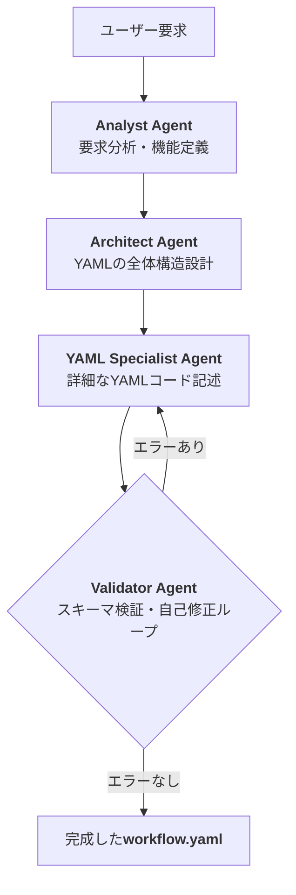

# 設計方針書：宣言的アーキテクチャへの移行

## 1. はじめに

本ドキュメントは、我々のプラットフォームが目指す次世代アーキテクチャ、「宣言的アーキテクチャ」の設計思想、全体像、およびそれを構成する主要コンポーネントの役割を定義するものである。これまでの議論で合意された重要な論点を集約し、今後の開発における揺るぎない羅針盤として機能することを目的とする。

## 2. 設計思想：コード生成から宣言的設定へ

我々は、LLMにアプリケーションの「コード」を直接生成させるアプローチから、アプリケーションの「設計図」にあたる**宣言的な設定ファイル（`workflow.yaml`）**を生成させるアプローチへと、アーキテクチャを根本的に転換する。

この新しいモデルでは、LLMエージェントはアプリケーションのロジックを直接記述するのではなく、処理の手順書を生成することに専念する。そして、事前に用意された単一の**汎用実行エンジン（Generic Execution Engine）**が、このYAMLファイルを読み込み、記述された手順に従ってアプリケーションを動的に実行する。

### 2.1. 宣言的アーキテクチャがもたらす価値

この転換は、単なる技術的な変更ではなく、プラットフォームの根幹に関わる価値の向上をもたらす。

| 価値 | 詳細 |
| :--- | :--- |
| **セキュリティ (Security)** | LLMが実行可能なコードを一切生成しないため、悪意のあるコードが注入されるリスク（コードインジェクション脆弱性）を**根本的に排除**する。 |
| **信頼性 (Reliability)** | LLMにとって、厳密な構文を持つプログラミング言語よりも、構造化されたデータ形式（YAML）を生成する方がはるかに容易であり、出力が安定する。これにより、「生成されたコードが動かない」といった問題がなくなる。 |
| **保守性 (Maintainability)** | アプリケーションのコアロジックは単一の汎用実行エンジンに集約される。エンジンの改善は、生成されたすべてのアプリケーションに即座に反映される。 |
| **柔軟性 (Flexibility)** | ビジネスロジックの変更は、YAMLファイルを修正するだけで完了する。コードの再生成や再デプロイは不要である。 |
| **可読性 (Readability)** | YAMLファイルは人間が読み書きしやすく、Gitなどのバージョン管理システムで変更履歴を容易に追跡できる。 |

## 3. アーキテクチャ全体像

```mermaid
graph TD
    subgraph 生成時
        A[ユーザー要求] --> B{LLMエージェント群};
        B -- 対話・検証・自己修正 --> C[<B>workflow.yaml</B>];
        C --> D[アプリケーションパッケージ];
    end

    subgraph 実行時
        E[ユーザー] --> F[汎用フロントエンド];
        F -- APIリクエスト --> G{汎用実行エンジン};
        G -- <B>workflow.yaml</B>を解釈 --> H[処理パイプライン実行];
        H -- 状態を保存・復元 --> I[<B>状態管理DB (Redis)</B>];
        H -- API呼び出し --> J[Dify / モックサーバー];
        G -- UI更新指示 --> F;
    end
```

1.  **アプリ生成時**: LLMエージェント群がユーザーと対話しながら、UI定義と処理パイプラインを含む`workflow.yaml`を生成し、`docker-compose.yml`と共にパッケージ化する。
2.  **アプリ実行時**: ユーザーが`docker-compose up`で起動すると、汎用フロントエンドと汎用実行エンジンが立ち上がる。ユーザー操作をトリガーに、実行エンジンが`workflow.yaml`を解釈し、状態をDBで管理しながら、Dify/モックAPIを呼び出して処理を実行する。

## 4. 主要コンポーネントと設計方針

### 4.1. `workflow.yaml`：アプリケーションの魂

`workflow.yaml`は、アプリケーションのすべてを定義する単一の設定ファイルである。

-   **`info`セクション**: アプリケーションの名称や説明などのメタデータ。
-   **`ui`セクション**: フロントエンドのUI要素を宣言的に定義する。これにより、LLMはバックエンドだけでなく、ユーザーが見る画面も設計できる。
-   **`workflows`セクション**: Difyやモックサーバーなどの外部APIのエンドポイントを定義する。環境変数による切り替えをサポートし、開発と本番のスムーズな移行を実現する。
-   **`pipeline`セクション**: バックエンドの処理フローをステップの配列として定義する。各ステップは、どのコンポーネントを、どのパラメータで実行するかを記述する。

### 4.2. 汎用実行エンジン：ステートフルな心臓部

汎用実行エンジンは、`workflow.yaml`を解釈・実行するステートフルなFastAPIアプリケーションである。

-   **役割**: YAMLの`pipeline`を解釈し、コンポーネントを呼び出し、処理フロー全体をオーケストレーションする。
-   **状態管理**: 複数ステップにまたがる処理や長時間の非同期処理をサポートするため、**セッションベースの状態管理**を行う。各セッション（`session_id`）の中間結果は、**外部データベース（Redisを推奨）**に保存される。これにより、対話的で複雑なアプリケーションの構築が可能となる。

### 4.3. Difyモックサーバー：開発を加速させる影武者

開発初期段階では、本物のDifyの代わりにモックサーバーを使用する。

-   **仕様**: 正常系のレスポンスを返すことに注力する。リクエストに含まれるパラメータの一部をレスポンスに含めるなど、**動的な振る舞い**をシミュレートすることで、より現実的な開発を可能にする。

### 4.4. LLMエージェント群：安定したYAML生成を支えるチーム

長い、あるいは複雑な`workflow.yaml`を安定して生成するために、単一のLLMに頼るのではなく、役割分担されたエージェント群が協調して動作する。



この**分業と自己修正のループ**こそが、高品質なYAML生成を保証する鍵である。

## 5. ユーザー体験：ダウンロードから実行まで

最終的にユーザーが手にするのは、専門知識を必要としない、非常にシンプルなパッケージである。

1.  **ダウンロード**: `docker-compose.yml`, `workflow.yaml`, `.env`ファイルを含むzipパッケージをダウンロードする。
2.  **設定**: `.env`ファイルに自身のAPIキーなどを記述する。
3.  **実行**: ターミナルで`docker-compose up -d`コマンドを一度実行する。

これにより、ユーザーは自身の環境で、複雑なセットアップなしに、生成されたアプリケーションを即座に利用開始できる。

## 6. 結論

本方針書で定義された「宣言的アーキテクチャ」は、LLMの能力を最大限に引き出しつつ、その不確実性を排除し、**セキュリティ、信頼性、保守性**を飛躍的に向上させるものである。これは、我々のプラットフォームが目指す「ビジネスロジックの究極的な抽象化」を実現するための、確固たる指針となる。
